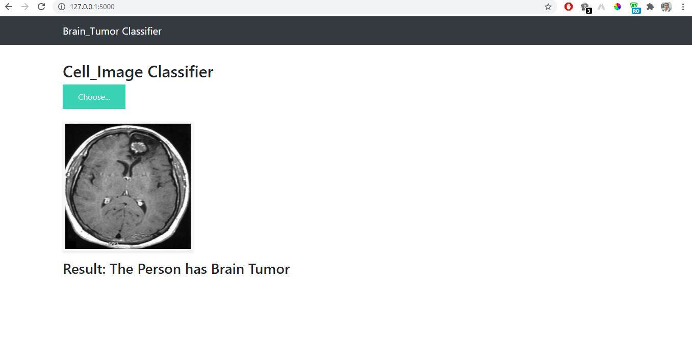

# Brain_Tumor_Detection
Brain_Tumor_Detection_Using CNN Architecture 

### Dataset:- https://www.kaggle.com/navoneel/brain-mri-images-for-brain-tumor-detection

A brain tumor is a mass or growth of abnormal cells in your brain.

Many different types of brain tumors exist. Some brain tumors are noncancerous (benign), and some brain tumors are cancerous (malignant). Brain tumors can begin in your brain (primary brain tumors), or cancer can begin in other parts of your body and spread to your brain (secondary, or metastatic, brain tumors).

How quickly a brain tumor grows can vary greatly. The growth rate as well as location of a brain tumor determines how it will affect the function of your nervous system.

## Webapp

# BrainTumorClassification
<h2>Overview</h2>

The important factor in the medical diagnosis include the medical image data obtained from various biomedical devices that uses different imaging techniques like X-ray, CT Scan, MRI. The conventional method for tumor detection in MRI image is human inspection. This method is very time consuming. It is not appropriate for large amount of data. In this model an efficient automated classification technique for brain MRI is proposed using machine learning algorithms. The CNN machine learning algorithm is used for classification of brain MR image.

<b>Project Link Online Deployed on Heroku : <a href="https://brain-tumor-classifier1.herokuapp.com/">https://brain-tumor-classifier1.herokuapp.com/</a></b>

<h2>Dataset and Libraries</h2>

<b>Dataset : <a href="https://www.kaggle.com/navoneel/brain-mri-images-for-brain-tumor-detection">https://www.kaggle.com/navoneel/brain-mri-images-for-brain-tumor-detection</a></b> 
<b>Libraries : </b>Python , Numpy , Pandas, Sklearn , Node.js , Express.js. 
<b>Frameworks : </b>VScode , jupyter Notebook , Heroku. 

<h2>Project Methodology</h2>

In this project I have developed a machine learning model to detect the presence of tumor in MRI scans of different people. The steps used in developing the machine learning model are of the one that are used in CNN.
Below is brief description of every step and technique used by me.  
<b>Tokenisation :</b> In this step first we break the given text into subsequent words involved. 
<b>Stopword Removal :</b>In this step we remove the words that don't play a role in determining the polarity of a sentiment like is,am,are etc. 
<b>Lemmatization :</b> Converting the words to thier base word using the part of speech tags and wordnet to convert it accordingly. 
<b>Building dictionary :</b>In this step we combine every sentiment to get a wholesome dictionary from which we classify the top occuring words which wll further be used to convert the sentiment into a binary vector. 
<b>Building Vectorizer :</b>In this step we basically check which words from the previous dictionary are present and absent at the same time. so now we have created a binary dataframe from the words in our dictionary. 
<b>Applying the machine learning Models :</b>In this step i applied three machine learning models below are their names and their corresponding accuracy. 
1. Naive Bayes Classifier : 79% 
2. Logistic Regression : 82% 
3. Support Vector Classifier : 84% 
as we can see the SVC classifer gave the best Accuracy so i downloaded the SVC model using pickle library and used it in my flask application.

<h2>ScreenShots of the Website Deployed</h2>
<b>
Entering a positive comment.
</b>

<b>
Predicting the output for the comment entered.
</b>

<b>
Entering a negative comment.
</b>

<b>
Predicting the sentiment of the comment entered with comment below in the box.
</b>

<h2>Running the Project</h2>

<b>1. Accesing the website online </b>

  
 To access the website and check its working you can visit this link <a href="https://senti-analysis98.herokuapp.com/">https://senti-analysis98.herokuapp.com/</a>  
 
<b>2. Copying to local repository </b>

  
 In your terminal run the following commands :   
     <b>
     git clone https://github.com/Steveroger5/Sentiment_Analysis.git 
     cd Sentiment_Analysis 
     python app.py 
     Open https://localhost:3000  
     </b>
  

 

 <h2>Methodology</h2>
 
 

 <h2>Contributors</h2>
 
<a href="https://github.com/Steveroger5">Gagandeep Singh</a>

 

