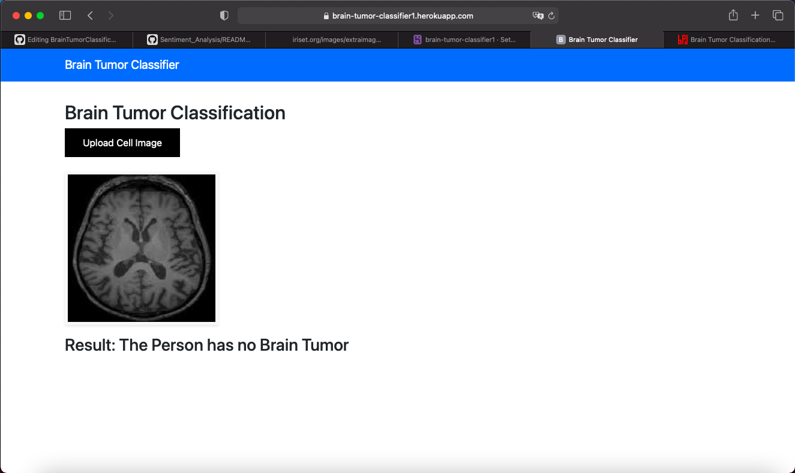

# Brain_Tumor_Detection
Brain_Tumor_Detection_Using CNN Architecture 

### Dataset:- https://www.kaggle.com/navoneel/brain-mri-images-for-brain-tumor-detection

A brain tumor is a mass or growth of abnormal cells in your brain.

Many different types of brain tumors exist. Some brain tumors are noncancerous (benign), and some brain tumors are cancerous (malignant). Brain tumors can begin in your brain (primary brain tumors), or cancer can begin in other parts of your body and spread to your brain (secondary, or metastatic, brain tumors).

How quickly a brain tumor grows can vary greatly. The growth rate as well as location of a brain tumor determines how it will affect the function of your nervous system.

## Webapp

# BrainTumorClassification
<h2>Overview</h2>

The important factor in the medical diagnosis include the medical image data obtained from various biomedical devices that uses different imaging techniques like X-ray, CT Scan, MRI. The conventional method for tumor detection in MRI image is human inspection. This method is very time consuming. It is not appropriate for large amount of data. In this model an efficient automated classification technique for brain MRI is proposed using machine learning algorithms. The CNN machine learning algorithm is used for classification of brain MR image.

<b>Project Link Online Deployed on Heroku : <a href="https://brain-tumor-classifier1.herokuapp.com/">https://brain-tumor-classifier1.herokuapp.com/</a></b>

<h2>Dataset and Libraries</h2>

<b>Dataset : <a href="https://www.kaggle.com/navoneel/brain-mri-images-for-brain-tumor-detection">https://www.kaggle.com/navoneel/brain-mri-images-for-brain-tumor-detection</a></b> 
<b>Libraries : </b>Python , Numpy , Pandas, Sklearn , Node.js , Express.js. 
<b>Frameworks : </b>VScode , jupyter Notebook , Heroku. 

<h2>Project Methodology</h2>

In this project I have developed a machine learning model to detect the presence of tumor in MRI scans of different people. The steps used in developing the machine learning model are of the one that are used in CNN. 
<b>Below is brief description of every step and technique used for CNN based Classification</b> 
In the training phase, preprocessing, feature exaction and classification with Loss function is performed to make a prediction model. Initially, label the training image set. In the preprocessing image resizing is applied to change size of the image. 
Finally, the convolution neural network is used for automatic brain tumor classification. The brain image dataset is taken from image net. Image net is a one of the pre-trained model. If you want to train from the starting layer, we have to train the entire layer (i.e) up to ending layer.   

<h2>Screenshots of the working Website</h2>
<b>
Initial Page.
</b>

<b>
After uploading the MRI scan.
</b>

<b>
Getting the required result after classification.
</b>

<h2>Running the Project</h2>

<b>1. Accesing the website online </b>

  
 To access the website and check its working you can visit this link <a href="https://brain-tumor-classifier1.herokuapp.com/">https://brain-tumor-classifier1.herokuapp.com/</a>  
 
<b>2. Copying to local repository </b>

  
 In your terminal run the following commands :   
     <b>
     git clone https://git.heroku.com/brain-tumor-classifier1.git 
     cd brain-tumor-classifier1 
     python app.py 
     Open https://localhost:3000  
     </b>
  

 

 <h2>Methodology</h2>
 
 

 <h2>Contributors</h2>
 
<a href="https://github.com/ElvisSethi">Elvis Sethi</a>

 

